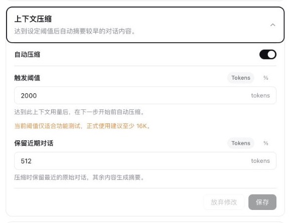

# deepseek-harness-compaction-ui

DeepSeek Harness 官方上下文压缩的可视化配置插件。

它在 Web 设置页中提供与 Harness 原生插件一致的配置卡片，可使用百分比或绝对 Tokens 调整自动压缩阈值和近期内容保留量。摘要、消息重放、checkpoint 与会话持久化仍由官方 `@deepseek-ai/dsh-compaction-basic` 负责。

## 功能

- 在 **设置 → 插件 → 插件配置** 中管理上下文压缩。
- 触发阈值支持百分比和绝对 Tokens。
- 近期内容保留量支持百分比和绝对 Tokens。
- 切换单位时自动换算等效值。
- 保存后热更新，不需要重新创建会话。
- 在输入框旁显示压缩阈值进度圆环。
- 支持按 provider/model 设置独立策略。

## 界面预览

### 插件配置



### 压缩阈值圆环

悬停圆环可查看当前上下文用量、自动压缩阈值和占用比例。达到阈值时圆环会变红；旁边的浅色圆环是 Harness 自带的上下文窗口占用率。


## 安装

发布到 npm 后，可安装到 DSH 的 Web profile：

```sh
npx @deepseek-ai/dsh plugin --profile web add deepseek-harness-compaction-ui
```

该命令只安装插件并退出，不会启动 DSH。

从本地源码安装：

```sh
npm install
npm run build
npx @deepseek-ai/dsh plugin --profile web add .
```

如果 DSH 已经运行，请在安装后重启现有服务。

## 使用

安装后打开：

**设置 → 插件 → 插件配置 → 上下文压缩**

| 设置 | Tokens 模式 | 百分比模式 |
| --- | --- | --- |
| 触发阈值 | 达到固定 Token 数后压缩 | 按模型上下文窗口的比例触发 |
| 保留近期对话 | 固定保留最近的 Token 数 | 按模型上下文窗口的比例保留 |

百分比模式会同时显示按当前上下文窗口换算的近似 Token 数。保留量必须小于触发阈值，否则无法保存。

默认策略：

| 设置 | 默认值 |
| --- | ---: |
| 自动压缩 | 开启 |
| 触发阈值 | 256,000 Tokens |
| 保留近期对话 | 64,000 Tokens |
| 上下文窗口 | 1,000,000 Tokens |

## 实现边界

本插件不是另一套压缩引擎。它只负责：

1. 展示和保存可视化设置。
2. 将绝对触发值换算为官方引擎使用的 `thresholdRatio`。
3. 将百分比策略直接传给官方 `thresholdRatio` 和 `retainRatio`。
4. 校验配置并在运行时热更新策略。

压缩范围选择、工具调用配对、摘要生成、消息替换、持久化事件、取消和上下文溢出恢复均由 DeepSeek Harness 官方组件处理。

## 高级配置

通常不需要手动编辑 YAML。需要为自定义模型设置独立窗口或策略时，可在 profile 的 `cordis.patch.yml` 中覆盖插件配置：

```yaml
- id: compaction-absolute-tokens
  config:
    thresholdMode: ratio
    thresholdRatio: 0.8
    retainMode: ratio
    retainRatio: 0.16
    thresholdTokens: 256000
    retainTokens: 64000
    contextWindowTokens: 1000000
    maxTokens: 8192
    compactionRetries: 1
    maxOverflowRetries: 1
    auto: true
    targets:
      - provider: deepseek-official
        model: deepseek-v4-flash
      - provider: deepseek-official
        model: deepseek-v4-pro
```

`thresholdMode` 和 `retainMode` 可分别设为 `tokens` 或 `ratio`。YAML 中的比例使用 0 到 1，例如 `0.8` 表示 80%。

绝对触发模式依赖 `contextWindowTokens` 完成换算。自定义模型应填写与其适配器实际容量一致的上下文窗口。

DSH 会整体替换同一插件条目的 `config`，手动覆盖时应重述需要保留的字段。内部 ID `compaction-absolute-tokens` 为兼容已有 profile 而保留。

## 注意事项

上下文压缩可以控制历史消息增长，但不能解决所有容量问题，例如：

- 单条消息或工具结果本身超过预算。
- System prompt 与工具 Schema 已接近上下文上限。
- 摘要模型持续失败或外部服务不可用。
- 多轮摘要导致的信息损耗。

关键任务状态应写入仓库文件或其他持久化存储，不应只存在于对话历史中。

## 开发

```sh
npm install
npm run check
npm run pack:check
```

项目当前基于 DeepSeek Harness `0.1.0-rc.6` API。

## 发布

项目使用 [Changesets](https://github.com/changesets/changesets) 管理版本和变更日志，并通过 [`.github/workflows/publish.yml`](./.github/workflows/publish.yml) 发布到 npm。

开发功能或修复时创建 changeset：

```sh
npm run changeset
```

选择 `patch`、`minor` 或 `major`，填写变更说明，并将生成的 `.changeset/*.md` 文件与代码一起提交。

合并到 `main` 后，GitHub Actions 会自动创建或更新 **Release PR**，其中包含版本号和 changelog。合并 Release PR 后，Actions 会自动：

1. 构建并运行测试。
2. 发布新版本到 npm。
3. 创建 Git 标签。
4. 创建 GitHub Release。

推荐在 npm 包设置中配置 **Trusted Publisher**：

| 项目 | 值 |
| --- | --- |
| Provider | GitHub Actions |
| Organization or user | `preflower` |
| Repository | `deepseek-harness-compaction-ui` |
| Workflow filename | `publish.yml` |
| Allowed action | `npm publish` |

配置完成后，工作流使用 OIDC 发布，无需保存长期 npm Token。首次发布时如果 npm 尚不能配置 Trusted Publisher，可在 GitHub 仓库的 **Settings → Secrets and variables → Actions** 中临时添加 `NPM_TOKEN`；首次发布成功并配置 Trusted Publisher 后即可删除该 Secret。

当前仓库包含初始 `minor` changeset。首次推送到 `main` 会创建 `0.1.0` Release PR；只有合并该 PR 后才会正式发布。

## License

[MIT](./LICENSE)
